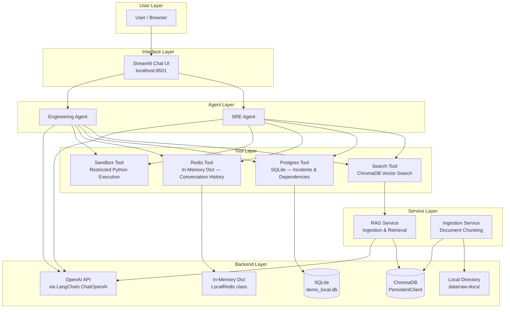
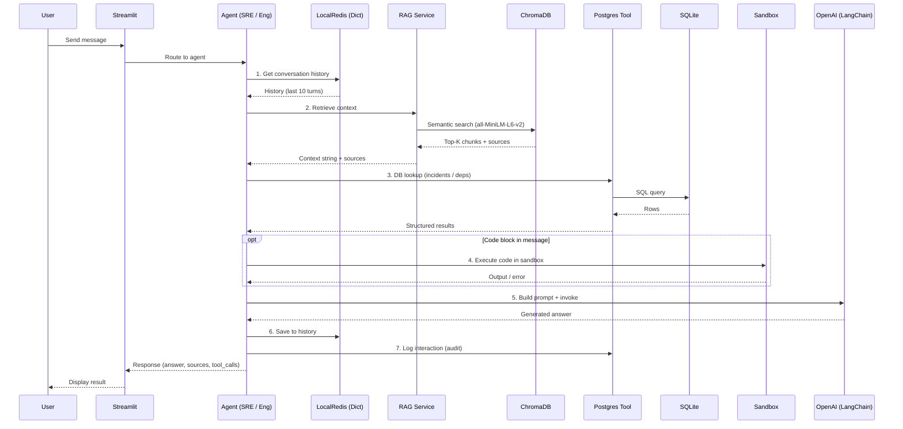
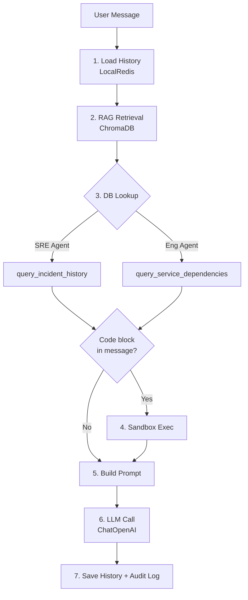
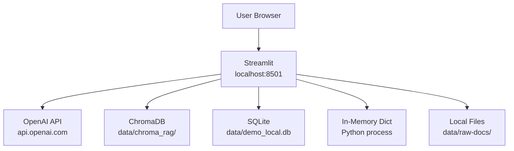
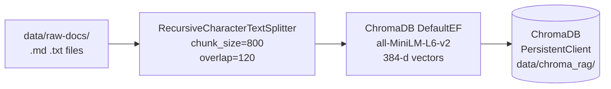

# Agentic RAG Platform — Local Architecture & Tech Stack

This document describes the architecture and technology stack of the **local (no-Azure) implementation** of the Agentic RAG platform.

---

## High-Level Architecture



---

## Request Flow — Agent Execution Pipeline



---

## Tech Stack & Components

### 1. LLM — OpenAI via LangChain

| Aspect | Detail |
|---|---|
| **Library** | `langchain-openai` (`ChatOpenAI`) |
| **Auth** | Standard OpenAI API key (`OPENAI_API_KEY` in `.env`) |
| **Model** | `gpt-4o` (configurable via `OPENAI_MODEL`) |
| **Temperature** | `0.2` (configurable via `LLM_TEMPERATURE`) |
| **Invocation** | `llm.invoke([SystemMessage, HumanMessage, ...])` |

### 2. Vector Store — ChromaDB

| Aspect | Detail |
|---|---|
| **Library** | `chromadb` (`PersistentClient`) |
| **Storage path** | `data/chroma_rag/` (SQLite-backed on disk) |
| **Embeddings** | `DefaultEmbeddingFunction` — all-MiniLM-L6-v2 (384 dimensions) |
| **Search type** | Approximate nearest neighbour (ANN) |
| **Embedding cost** | Free — runs locally via `sentence-transformers` |
| **Chunking** | `RecursiveCharacterTextSplitter` (800 chars, 120 overlap) |

### 3. Relational Database — SQLite

| Aspect | Detail |
|---|---|
| **Library** | Python built-in `sqlite3` |
| **File** | `data/demo_local.db` |
| **Auth** | None (local file) |
| **Tables** | `incidents`, `service_dependencies`, `agent_interactions` |

```
┌─────────────────────┐  ┌────────────────────────┐  ┌──────────────────────┐
│ incidents            │  │ service_dependencies   │  │ agent_interactions   │
├─────────────────────┤  ├────────────────────────┤  ├──────────────────────┤
│ id (PK)             │  │ id (PK)                │  │ id (PK)              │
│ service             │  │ upstream               │  │ session_id           │
│ severity            │  │ downstream             │  │ agent                │
│ title               │  │ dependency_type        │  │ query                │
│ started_at          │  │                        │  │ answer               │
│ resolved_at         │  │                        │  │ created_at           │
│ summary             │  │                        │  │                      │
└─────────────────────┘  └────────────────────────┘  └──────────────────────┘
```

### 4. Session Store — In-Memory Dict

| Aspect | Detail |
|---|---|
| **Implementation** | `LocalRedis` class (Python `dict[str, str]`) |
| **Operations** | `get()`, `setex()`, `ping()` |
| **History limit** | Last 20 turns per session |
| **Key pattern** | `session:{prefix}:{session_id}:history` |
| **Persistence** | None — lost on process restart |

### 5. Document Storage — Local Filesystem

| Aspect | Detail |
|---|---|
| **Directory** | `data/raw-docs/` |
| **Supported types** | `.md`, `.txt` |
| **Upload methods** | Copy files to directory, or use the Streamlit Ingest tab |

### 6. User Interface — Streamlit

| Aspect | Detail |
|---|---|
| **Framework** | Streamlit |
| **Auth** | None |
| **Tabs** | Chat, Ingest Documents, Health |
| **Launch command** | `streamlit run notebooks/streamlit_app_noAzure.py` |
| **Default URL** | `http://localhost:8501` |

### 7. Sandbox Tool — Restricted Python Execution

| Aspect | Detail |
|---|---|
| **Implementation** | Restricted `exec()` with allowlisted builtins |
| **Allowed builtins** | 18 safe functions: `print`, `len`, `range`, `enumerate`, `zip`, `list`, `dict`, `set`, `tuple`, `str`, `int`, `float`, `bool`, `type`, `isinstance`, `min`, `max`, `sum` |
| **Restrictions** | No imports, no file I/O, no network access |
| **Timeout** | 10 seconds |

---

## Agent Architecture

Both agents follow the same 7-step pipeline, differing only in their system prompt and which database tool they invoke at step 3.



| | SRE Agent | Engineering Agent |
|---|---|---|
| **Focus** | Incident triage, RCA, runbook lookup, postmortem | Architecture, code review, debugging, best practices |
| **DB Tool** | `query_incident_history(service)` | `query_service_dependencies(service)` |
| **System Prompt** | Operations / reliability oriented | Software design / code quality oriented |

---

## Deployment Topology



---

## Ingestion Pipeline



---

## Configuration

The local implementation requires only three environment variables in a `.env` file at the project root:

```dotenv
OPENAI_API_KEY=sk-...
OPENAI_MODEL=gpt-4o
LLM_TEMPERATURE=0.2
```

### Additional Settings (with defaults)

| Setting | Default | Description |
|---|---|---|
| `data_dir` | `data` | Base data directory |
| `db_path` | `data/demo_local.db` | SQLite database path |
| `docs_dir` | `data/raw-docs` | Document source directory |
| `chroma_rag_dir` | `data/chroma_rag` | ChromaDB persistent storage |
| `rag_chunk_size` | `800` | Characters per chunk |
| `rag_chunk_overlap` | `120` | Overlap between chunks |
| `rag_top_k` | `5` | Number of chunks to retrieve per query |

---

## Python Dependencies

```
openai
langchain
langchain-openai
langchain-text-splitters
chromadb
pydantic
pydantic-settings
httpx
streamlit
```

Requires **Python >= 3.10**.
