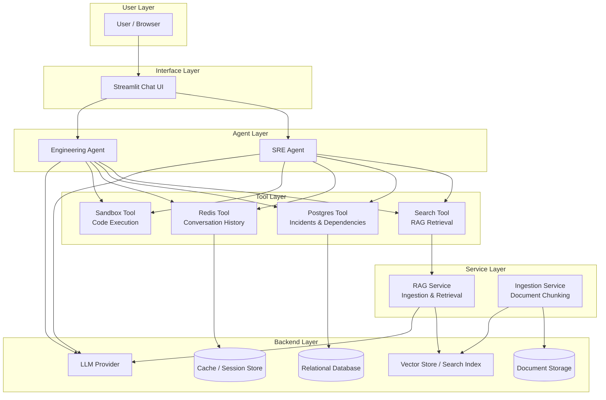
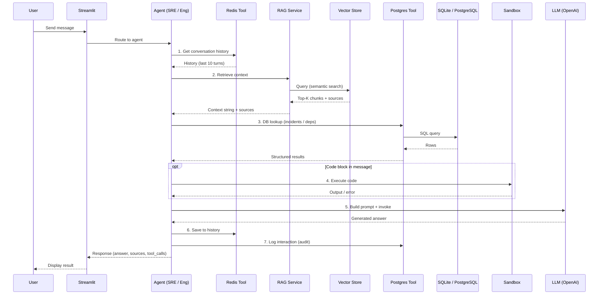
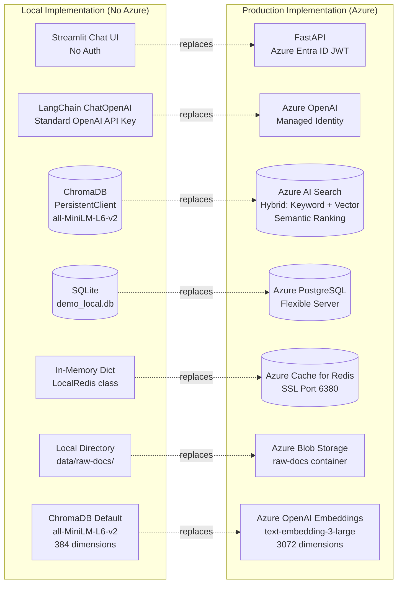
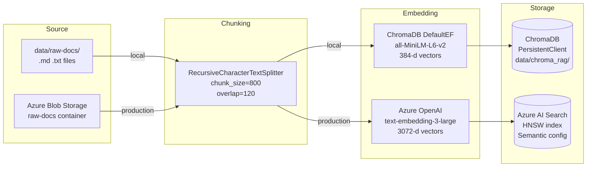
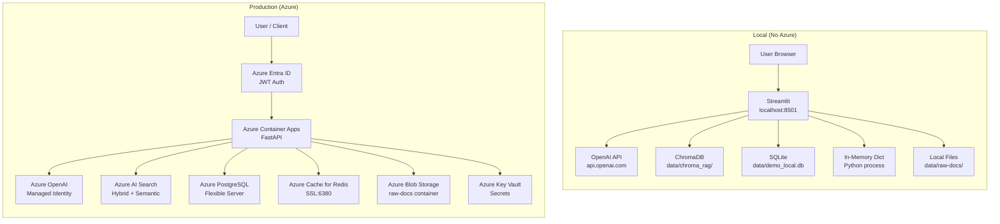

# Agentic RAG Platform — Architecture (Local vs Production)

This document describes the architecture of the Agentic RAG platform as demonstrated in `demo_example_noAzure.ipynb`, and highlights the differences between the **local (no-Azure)** implementation and the **production (Azure-backed)** deployment.

---

## High-Level Architecture



---

## Request Flow — Agent Execution Pipeline



---

## Component Comparison — Local vs Production



---

## Data Flow — Ingestion Pipeline



---

## Detailed Differences

### 1. LLM Provider

| Aspect | Local (No Azure) | Production (Azure) |
|---|---|---|
| **Client** | `langchain_openai.ChatOpenAI` | `openai.AzureOpenAI` |
| **Auth** | Standard OpenAI API key (`sk-...`) | Azure Managed Identity or API key |
| **Endpoint** | `https://api.openai.com/v1` (default) | `https://<name>.openai.azure.com` |
| **Model** | `gpt-4o` (OpenAI model name) | `gpt-4o` (Azure deployment name) |
| **API Version** | Not applicable | `2024-05-01-preview` |
| **Invocation** | `llm.invoke([messages])` → LangChain | `openai_client.chat.completions.create()` |
| **Temperature** | 0.2 (configurable via `.env`) | 0.2 (SRE) / 0.3 (Engineering) |

### 2. Vector Store / Search

| Aspect | Local (No Azure) | Production (Azure) |
|---|---|---|
| **Technology** | ChromaDB (PersistentClient) | Azure AI Search |
| **Storage** | `data/chroma_rag/` (SQLite-backed) | Azure-managed cloud index |
| **Embeddings** | `DefaultEmbeddingFunction` (all-MiniLM-L6-v2, 384-d) | Azure OpenAI `text-embedding-3-large` (3072-d) |
| **Search Type** | Approximate nearest neighbour (ANN) | Hybrid: keyword + vector + semantic ranking |
| **Chunking** | `RecursiveCharacterTextSplitter` (800 chars, 120 overlap) | Same chunking logic |
| **Index Schema** | ChromaDB collection with metadata | Fields: id, content, title, source, content_vector |
| **Embedding Cost** | Free (runs locally via sentence-transformers) | Pay-per-token via Azure OpenAI |

### 3. Database (PostgreSQL vs SQLite)

| Aspect | Local (No Azure) | Production (Azure) |
|---|---|---|
| **Technology** | SQLite (`data/demo_local.db`) | Azure Database for PostgreSQL Flexible Server |
| **Connection** | `sqlite3.connect()` (file-based) | `asyncpg` / `psycopg2` with SSL |
| **Auth** | No auth (local file) | Azure Key Vault secret (`Postgres-AdminPassword`) |
| **Schema** | Same 3 tables | Same 3 tables |
| **Tables** | `incidents`, `service_dependencies`, `agent_interactions` | Same |
| **Concurrency** | `check_same_thread=False` | Native PostgreSQL concurrency |

```
Tables (identical schema):
┌─────────────────────┐  ┌────────────────────────┐  ┌──────────────────────┐
│ incidents            │  │ service_dependencies   │  │ agent_interactions   │
├─────────────────────┤  ├────────────────────────┤  ├──────────────────────┤
│ id (PK)             │  │ id (PK)                │  │ id (PK)              │
│ service             │  │ upstream               │  │ session_id           │
│ severity            │  │ downstream             │  │ agent                │
│ title               │  │ dependency_type        │  │ query                │
│ started_at          │  │                        │  │ answer               │
│ resolved_at         │  │                        │  │ created_at           │
│ summary             │  │                        │  │                      │
└─────────────────────┘  └────────────────────────┘  └──────────────────────┘
```

### 4. Cache / Session Store (Redis)

| Aspect | Local (No Azure) | Production (Azure) |
|---|---|---|
| **Technology** | `LocalRedis` class (Python dict) | Azure Cache for Redis |
| **Storage** | `dict[str, str]` in memory | Redis server (SSL, port 6380) |
| **Auth** | None | Azure Key Vault secret (`Redis-PrimaryKey`) |
| **TTL** | Ignored (stored indefinitely until process exits) | 3600s (1 hour) enforced by Redis |
| **Persistence** | Lost on restart | Redis persistence (AOF/RDB) |
| **Operations** | `get()`, `setex()`, `ping()` | Same interface via `redis-py` |
| **History Limit** | Last 20 turns per session | Same |
| **Key Pattern** | `session:{prefix}:{session_id}:history` | Same |

### 5. Document Storage

| Aspect | Local (No Azure) | Production (Azure) |
|---|---|---|
| **Technology** | Local filesystem (`data/raw-docs/`) | Azure Blob Storage |
| **Container** | Directory on disk | Blob container (`raw-docs`) |
| **File Types** | `.md`, `.txt` | `.md`, `.txt`, `.pdf` |
| **Access** | Direct file I/O (`Path.read_text()`) | `BlobServiceClient` with Managed Identity |
| **Upload** | Copy files to directory / Streamlit uploader | Streamlit uploader / API call |

### 6. API / User Interface

| Aspect | Local (No Azure) | Production (Azure) |
|---|---|---|
| **Framework** | Streamlit | FastAPI |
| **Auth** | None | Azure Entra ID (AAD) JWT validation |
| **Endpoints** | Streamlit tabs (Chat, Ingest, Health) | `/chat`, `/ingest`, `/documents`, `/health` |
| **Session** | Streamlit `session_state` | JWT `session_id` claim |
| **Deployment** | `streamlit run streamlit_app_noAzure.py` | Azure Container Apps (Docker) |

### 7. Sandbox Tool

| Aspect | Local (No Azure) | Production (Azure) |
|---|---|---|
| **Implementation** | Identical — restricted `exec()` | Identical — restricted `exec()` |
| **Allowed builtins** | 18 safe builtins (print, len, range, etc.) | Same |
| **Restrictions** | No imports, no file I/O, no network | Same |
| **Timeout** | 10 seconds | 10 seconds |

> The Sandbox Tool is the **only component with zero differences** between local and production.

---

## Agent Architecture

```mermaid
flowchart TB
    subgraph "SRE Agent"
        SRE_IN[User Message] --> SRE_HIST[1. Load History<br>Redis Tool]
        SRE_HIST --> SRE_RAG[2. RAG Retrieval<br>ChromaDB / AI Search]
        SRE_RAG --> SRE_INC[3. Incident Lookup<br>SQLite / PostgreSQL]
        SRE_INC --> SRE_SB{Code block<br>detected?}
        SRE_SB -->|Yes| SRE_EXEC[4. Sandbox Exec]
        SRE_SB -->|No| SRE_BUILD[5. Build Prompt]
        SRE_EXEC --> SRE_BUILD
        SRE_BUILD --> SRE_LLM[6. LLM Call<br>ChatOpenAI / Azure OpenAI]
        SRE_LLM --> SRE_SAVE[7. Save History + Audit Log]
    end

    subgraph "Engineering Agent"
        ENG_IN[User Message] --> ENG_HIST[1. Load History<br>Redis Tool]
        ENG_HIST --> ENG_RAG[2. RAG Retrieval<br>ChromaDB / AI Search]
        ENG_RAG --> ENG_DEP[3. Dependency Lookup<br>SQLite / PostgreSQL]
        ENG_DEP --> ENG_SB{Code block<br>detected?}
        ENG_SB -->|Yes| ENG_EXEC[4. Sandbox Exec]
        ENG_SB -->|No| ENG_BUILD[5. Build Prompt]
        ENG_EXEC --> ENG_BUILD
        ENG_BUILD --> ENG_LLM[6. LLM Call<br>ChatOpenAI / Azure OpenAI]
        ENG_LLM --> ENG_SAVE[7. Save History + Audit Log]
    end
```



### Key Agent Differences

| Step | SRE Agent | Engineering Agent |
|---|---|---|
| **Step 3** | `query_incident_history(service)` — looks up past incidents | `query_service_dependencies(service)` — looks up dependency graph |
| **System Prompt** | RCA, remediation, triage, runbook lookup, postmortem | Architecture, code review, debugging, best practices |
| **LLM Temperature** | 0.2 (more deterministic for ops) | 0.2 local / 0.3 production (slightly more creative) |

---

## Deployment Topology



---

## Configuration Comparison

```
# ─── Local .env (minimal) ───────────────────
OPENAI_API_KEY=sk-...
OPENAI_MODEL=gpt-4o
LLM_TEMPERATURE=0.2

# ─── Production .env (full Azure) ───────────
AZURE_CLIENT_ID=<managed-identity-client-id>
AZURE_SEARCH_ENDPOINT=https://<search>.search.windows.net
AZURE_OPENAI_ENDPOINT=https://<openai>.openai.azure.com
AZURE_OPENAI_API_KEY=<api-key>
AZURE_OPENAI_DEPLOYMENT=gpt-4o
AZURE_OPENAI_EMBEDDING_DEPLOYMENT=text-embedding-3-large
AZURE_OPENAI_API_VERSION=2024-05-01-preview
BLOB_URI=https://<storage>.blob.core.windows.net/raw-docs
KEYVAULT_URI=https://<vault>.vault.azure.net
POSTGRES_HOST=<host>.postgres.database.azure.com
POSTGRES_DB=ragdb
POSTGRES_USER=postgres
REDIS_HOST=<name>.redis.cache.windows.net
ENTRA_TENANT_ID=<tenant-id>
ENTRA_AUDIENCE=api://<app-id>
```

---

## Summary

The local implementation replaces **7 Azure services** with lightweight local substitutes while preserving identical agent logic, tool interfaces, and data schemas. The Sandbox Tool is the only component that is completely unchanged between environments.

| Azure Service Replaced | Local Substitute | Key Trade-off |
|---|---|---|
| Azure OpenAI | Standard OpenAI via LangChain | No Managed Identity; uses API key directly |
| Azure AI Search | ChromaDB (PersistentClient) | No hybrid/semantic ranking; smaller embeddings (384-d vs 3072-d) |
| Azure PostgreSQL | SQLite | No concurrency; no SSL; file-based |
| Azure Cache for Redis | Python dict (`LocalRedis`) | No TTL enforcement; no persistence; lost on restart |
| Azure Blob Storage | Local filesystem | No cloud access; manual file placement |
| Azure Entra ID + FastAPI | Streamlit (no auth) | No authentication or RBAC |
| Azure Key Vault | Direct env vars | Secrets in plaintext `.env` file |
